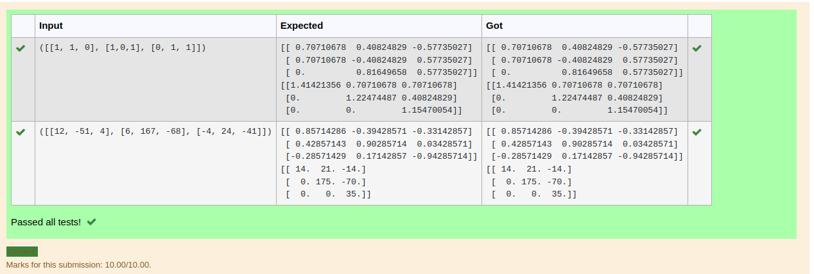

# Algorithm for QR Decomposition
## Aim:
To implement QR decomposition algorithm using the Gram-Schmidt method.
## Equipment’s required:
1.	Hardware – PCs
2.	Anaconda – Python 3.7 Installation / Moodle-Code Runner
## Algorithm:
1.	Intialize the matrix Q and u
2.	The vector u and e is given by

    

    

    

3.	Obtain the Q matrix   
    
4.	Construct the upper triangular matrix R
    


## Program:
### Gram-Schmidt Method
```python
''' 
Program to QR decomposition using the Gram-Schmidt method
Developed by: S.JEGADEESH
RegisterNumber: 22004355
'''
import numpy as np 
arr=np.array(eval(input()))
n,m=arr.shape
u=np.empty((n,m))
e=np.empty((n,m))
u[:,0]=arr[:,0]
e[:,0]=u[:,0]/np.linalg.norm(u[:,0])
for i in range(n):
    u[:,i]=arr[:,i]
    for j in range(i):
        u[:,i] -= (arr[:,i]@e[:,j])*e[:,j]
        e[:,i] =u[:,i]/np.linalg.norm(u[:,i])
r=np.zeros((n,m))
for i in range(n):
    for j in range(i,m):
        r[i,j]=arr[:,j]@e[:,i]
print(e)
print(r)


```

## Output


## Result
Thus the QR decomposition algorithm using the Gram-Schmidt process is written and verified the result.